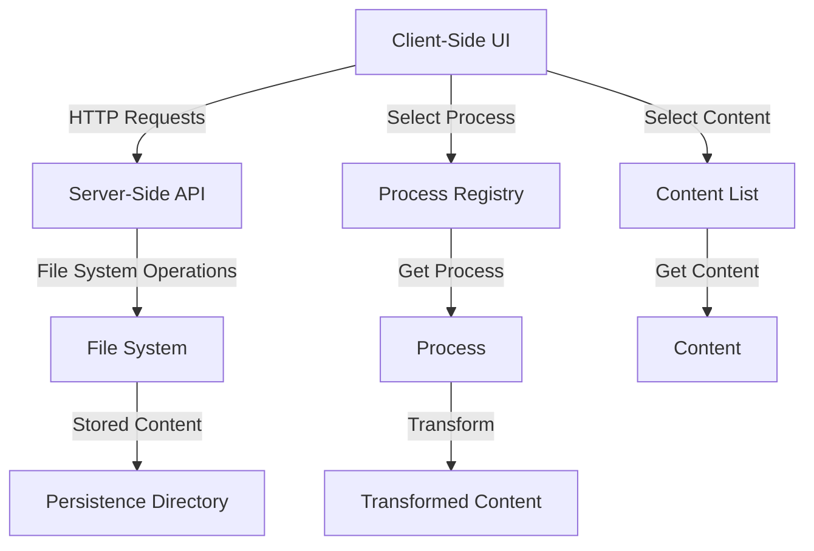
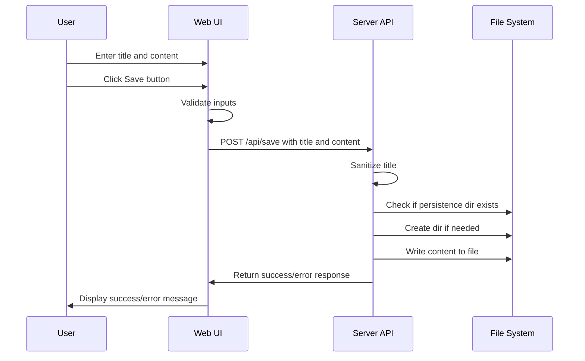
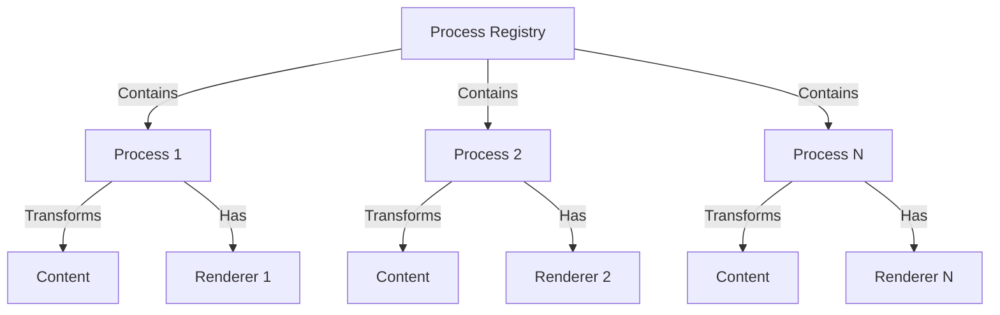

# System Patterns: Section Extraction Research Tool

## System Architecture
The Section Extraction Research Tool follows a client-server architecture within the SvelteKit framework, with a process registry system for content transformation:

## Key Technical Decisions

### 1. SvelteKit Framework
- **Decision**: Use SvelteKit as the application framework
- **Rationale**: 
  - Provides both client and server-side capabilities in a single framework
  - Offers built-in routing and API endpoints
  - Enables easy file system access through server endpoints
  - Lightweight and performant for a simple application

### 2. File System Storage
- **Decision**: Store content directly as markdown files in the filesystem
- **Rationale**:
  - Simplifies access to the content for external processing by LLM systems
  - Avoids the complexity of setting up and managing a database
  - Makes content easily portable and accessible outside the application
  - Markdown format preserves text structure while being human-readable

### 3. Minimal UI Approach
- **Decision**: Implement a minimal UI without complex styling or components
- **Rationale**:
  - Focuses on core functionality for the research tool
  - Accelerates development of the initial version
  - Aligns with the research-oriented nature of the project

### 4. Server-Side File Operations
- **Decision**: Handle all file operations on the server side
- **Rationale**:
  - Browser security restrictions prevent direct filesystem access from client-side code
  - Centralizes file handling logic in one place
  - Provides a clean API for client-server communication

## Component Relationships

### Client-Side Components
- **Page Component** (`+page.svelte`): Contains the form UI, content display, and process execution UI
- **Form Handling**: Manages form state and submission to the server endpoint
- **Process Selection**: Allows selecting processes from the registry
- **Content Selection**: Enables selecting multiple content items for processing

### Server-Side Components
- **API Endpoints**:
  - `api/save/+server.ts`: Handles POST requests to save content
  - `api/list/+server.ts`: Handles GET requests to list available content
  - `api/content/+server.ts`: Handles GET requests to retrieve specific content
- **Configuration** (`lib/config.ts`): Defines paths and configuration settings
- **File System Operations**: Creates directories and writes files to the persistence folder

### Process Registry System
- **Process Registry** (`lib/processes/registry.ts`): Manages registration and retrieval of processes
- **Process Interface** (`lib/processes/types.ts`): Defines the structure of processes and renderers
- **Process Implementations** (`lib/processes/implementations/`): Contains specific process implementations
- **Components** (`lib/processes/components/`): Contains Svelte components for rendering process outputs

## Data Flow

## Error Handling
- Client-side validation ensures title and content are provided
- Server-side validation checks for valid inputs and proper title sanitization
- Try-catch blocks handle file system operation errors
- Error messages are propagated back to the client for user feedback

## Process Registry System

The Process Registry system is a key architectural component that enables extensible content transformation:

### Key Components

1. **Process Registry**: A singleton that maintains a collection of registered processes
   - Provides methods to register processes
   - Allows retrieving all processes or a specific process by ID

2. **Process Interface**: A generic interface that defines:
   - Process metadata (ID, name, description)
   - A processing function that transforms content
   - A renderer for displaying the transformed content

3. **Renderer Type**: A generic type that defines:
   - A Svelte component that can render the transformed content

4. **Process Implementation**: Concrete implementations of processes
   - Each process defines how to transform content
   - Each process specifies a renderer for its output

### Process Flow

1. User selects a process from the registry
2. User selects one or more content items to process
3. When the user clicks "Run Process":
   - The system fetches each selected content item
   - The selected process transforms each content item
   - The results are logged to the console (future: displayed using the process's renderer)

### Benefits

- **Extensibility**: New processes can be added without modifying existing code
- **Type Safety**: Generic types ensure process output matches renderer input
- **Separation of Concerns**: Processing logic is separate from rendering logic
- **Reusability**: Processes and renderers can be reused across the application

## Future Architecture Considerations
- Adding a tagging system for content organization
- Implementing content listing and retrieval functionality
- Integrating with LLM processing systems
- Adding visualization components for section hierarchy
- Implementing more sophisticated processes for content transformation
- Adding persistence for process results
