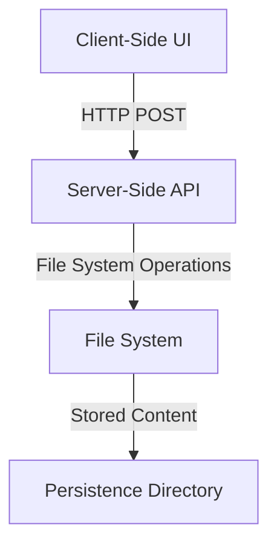
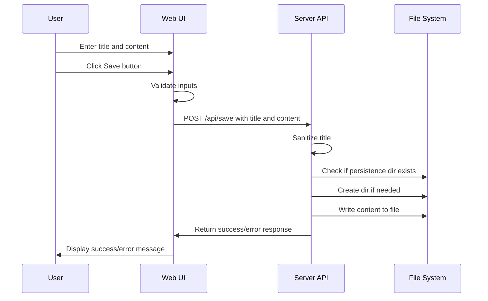

# System Patterns: Section Extraction Research Tool

## System Architecture
The Section Extraction Research Tool follows a simple client-server architecture within the SvelteKit framework:

## Key Technical Decisions

### 1. SvelteKit Framework
- **Decision**: Use SvelteKit as the application framework
- **Rationale**: 
  - Provides both client and server-side capabilities in a single framework
  - Offers built-in routing and API endpoints
  - Enables easy file system access through server endpoints
  - Lightweight and performant for a simple application

### 2. File System Storage
- **Decision**: Store content directly as markdown files in the filesystem
- **Rationale**:
  - Simplifies access to the content for external processing by LLM systems
  - Avoids the complexity of setting up and managing a database
  - Makes content easily portable and accessible outside the application
  - Markdown format preserves text structure while being human-readable

### 3. Minimal UI Approach
- **Decision**: Implement a minimal UI without complex styling or components
- **Rationale**:
  - Focuses on core functionality for the research tool
  - Accelerates development of the initial version
  - Aligns with the research-oriented nature of the project

### 4. Server-Side File Operations
- **Decision**: Handle all file operations on the server side
- **Rationale**:
  - Browser security restrictions prevent direct filesystem access from client-side code
  - Centralizes file handling logic in one place
  - Provides a clean API for client-server communication

## Component Relationships

### Client-Side Components
- **Page Component** (`+page.svelte`): Contains the form UI with title input, content textarea, and save button
- **Form Handling**: Manages form state and submission to the server endpoint

### Server-Side Components
- **API Endpoint** (`api/save/+server.ts`): Handles POST requests to save content
- **Configuration** (`lib/config.ts`): Defines paths and configuration settings
- **File System Operations**: Creates directories and writes files to the persistence folder

## Data Flow

## Error Handling
- Client-side validation ensures title and content are provided
- Server-side validation checks for valid inputs and proper title sanitization
- Try-catch blocks handle file system operation errors
- Error messages are propagated back to the client for user feedback

## Future Architecture Considerations
- Adding a tagging system for content organization
- Implementing content listing and retrieval functionality
- Integrating with LLM processing systems
- Adding visualization components for section hierarchy
